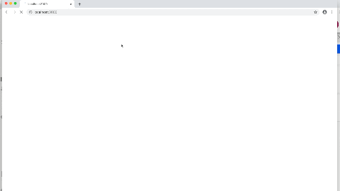

# house-of-microservices-openliberty-contract-testing-sample

## Scope



## Usage

```
mvn process-resources
mvn liberty:dev
```

Access the application on `http:\\localhost:9080`.

For development of the front-end, start the server and front end application separately:

```
mvn liberty:dev &
cd src/main/frontend
npm start
```

Access the application on `http:\\localhost:3000`.

## Notes

**NOTE: This repository has been configured with the [DCO bot](https://github.com/probot/dco).
When you set up a new repository that uses the Apache license, you should
use the DCO to manage contributions. The DCO bot will help enforce that.
Please contact one of the IBM GH Org stewards.**

If you have any questions or issues you can create a new [issue here][issues].

Pull requests are very welcome! Make sure your patches are well tested.
Ideally create a topic branch for every separate change you make. For
example:

1. Fork the repo
2. Create your feature branch (`git checkout -b my-new-feature`)
3. Commit your changes (`git commit -am 'Added some feature'`)
4. Push to the branch (`git push origin my-new-feature`)
5. Create new Pull Request

## License

All source files must include a Copyright and License header. The SPDX license header is
preferred because it can be easily scanned.

If you would like to see the detailed LICENSE click [here](LICENSE).

```text
#
# Copyright 2020- IBM Inc. All rights reserved
# SPDX-License-Identifier: Apache2.0
#
```
